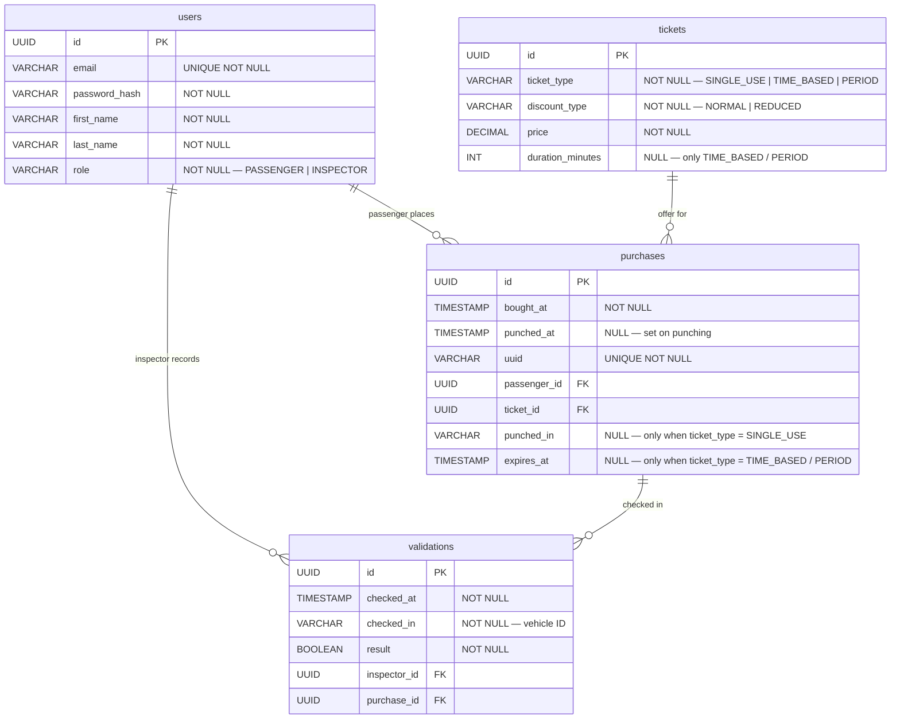

# piisw-projekt
Elektroniczny bilet miejski

# wymagania
Użytkownik uzyskuje możliwość rejestracji w serwisie oraz wygenerowanie wirtualnego biletu umożliwiającego korzystanie z systemu transportu zbiorowego. System umożliwia weryfikację sprawdzanych biletów.

Pasażer może założyć sobie konto w systemie. W ramach konta możliwe jest przeglądanie dostępnej oferty biletowe (bilety czasowe, jednorazowe, okresowe; ulgowe i normalne). Pasażer może wybrać dowolny bilet, wybrać jego ważność (w przypadku biletów czasowych i okresowych) oraz dokonać zakupu. Po zakupie, bilet pojawia się w zakładce "moje bilety". Każdy bilet posiada unikalnie wygenerowany kod, umożliwiający jego walidację.

System powinien posiadać prosty interfejs REST pozwalający na zintegrowanie z systemem kasowników (każdy bilet jednorazowy i czasowy wymaga skasowania, bilet nieskasowany jest nieważny).

Bileter posiada możliwość sprawdzenia ważności biletu - w tym celu konieczne jest wprowadzenie kodu biletu oraz identyfikatora pojazu. Bilet może być ważny lub nieważny. Bilet jest ważny tylko wtedy, gdy:

W przypadku biletu okresowego - data kontroli zawiera się w okresie ważności biletu.

W przypadku biletu jednorazowego - bilet został skasowany w pojeździe, w którym przeprowadzana jest kontrola.

W przypadku biletu czasowego - nie upłynął czas ważności biletu od momentu skasowania biletu.

System powinien obsługiwać dwie klasy użytkowników:

Pasażer
Funkcja wymaga zalogowania się do systemu. Kupujący może przeglądać dostępną ofertę biletową, kupić bilet oraz podglądać zakupione bilety wraz z historią transakcji.

Bileter
Funkcja wymaga zalogowania się do systemu. Bileter może sprawdzać ważność kodu biletu.

# technology
Java + Angular

## ER Diagram

